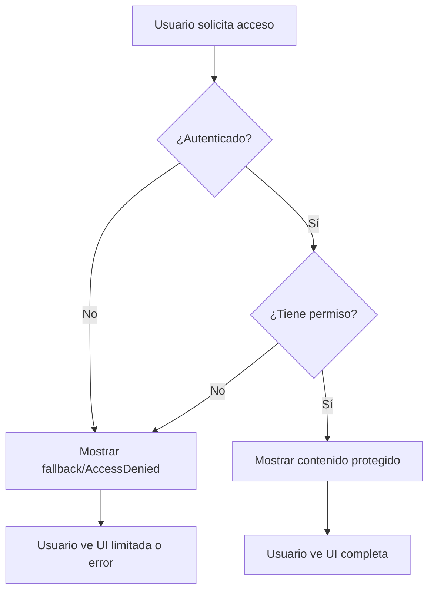

# Fase 2 — Autorización (RBAC en Cliente) ✅

## Resumen Ejecutivo

Se ha implementado un sistema completo de **Role-Based Access Control (RBAC)** en el cliente Flutter que permite controlar el acceso a funcionalidades y rutas basándose en los permisos y roles del usuario autenticado.

## 📋 Objetivos Completados

✅ **Widget Can** para control granular de UI por permisos  
✅ **Widget ProtectedRoute** para protección de rutas completas  
✅ **Integración con AuthController** para verificación en tiempo real  
✅ **Ejemplos funcionales** en HomePage y AdminPage  
✅ **Página de administración protegida** accesible solo con permisos

---

## 🏗️ Arquitectura Implementada

### 1. Widget `Can` - Control de UI por Permisos

**Ubicación:** `lib/shared/widgets/can.dart`

#### Características Principales:
- Oculta/muestra widgets según permisos del usuario
- Consulta permisos directamente desde `AuthController`
- Soporta widget `fallback` alternativo
- Modo de negación (`negate`) para lógica inversa

#### Variantes Disponibles:

##### `Can` - Verificación por código de permiso
```dart
Can(
  permissionCode: 'productos.crear',
  child: ElevatedButton(
    onPressed: () => crearProducto(),
    child: Text('Crear Producto'),
  ),
  fallback: Text('No tienes permiso'), // Opcional
)
```

##### `CanByRole` - Verificación por nombre de rol
```dart
CanByRole(
  roleName: 'Administrador',
  child: Text('Panel de Admin'),
  fallback: Text('Solo para admins'),
)
```

##### `CanMultiple` - Verificación de múltiples permisos
```dart
// AND: Requiere TODOS los permisos
CanMultiple(
  permissionCodes: ['productos.crear', 'productos.editar'],
  requireAll: true,
  child: Text('Gestión completa de productos'),
)

// OR: Requiere AL MENOS uno
CanMultiple(
  permissionCodes: ['reportes.ventas', 'reportes.inventario'],
  requireAll: false,
  child: Text('Ver cualquier reporte'),
)
```

---

### 2. Widget `ProtectedRoute` - Protección de Rutas

**Ubicación:** `lib/shared/widgets/protected_route.dart`

#### Características Principales:
- Protege rutas completas por permisos o roles
- Muestra página de "Acceso Denegado" personalizable
- Soporta redirección automática
- Loading automático durante verificación

#### Uso Básico:
```dart
GoRoute(
  path: '/admin',
  builder: (context, state) => ProtectedRoute(
    requiredPermission: 'admin.acceso',
    child: AdminPage(),
  ),
)
```

#### Con Widget de Acceso Denegado Personalizado:
```dart
ProtectedRoute(
  requiredPermission: 'usuarios.eliminar',
  accessDeniedWidget: CustomAccessDeniedPage(),
  child: DeleteUserPage(),
)
```

#### Con Redirección:
```dart
ProtectedRoute(
  requiredRole: 'Superadministrador',
  redirectOnDenied: true,
  onAccessDenied: () => context.go('/home'),
  child: SystemConfigPage(),
)
```

#### Variante `ProtectedRouteMultiple`:
```dart
ProtectedRouteMultiple(
  requiredPermissions: ['usuarios.crear', 'usuarios.editar'],
  requireAll: true, // AND
  child: UserManagementPage(),
)
```

---

## 🎯 Implementaciones de Ejemplo

### 1. HomePage - Acciones Condicionadas por Permisos

**Ubicación:** `lib/features/accounts/presentation/pages/home_page.dart`

Se han agregado botones que solo aparecen si el usuario tiene los permisos necesarios:

```dart
// Botón "Crear Producto" - Solo visible con permiso
Can(
  permissionCode: 'productos.crear',
  child: ElevatedButton.icon(
    onPressed: () => navegarACrearProducto(),
    icon: Icon(Icons.add_shopping_cart),
    label: Text('Crear Producto'),
  ),
  fallback: Container(
    // Muestra botón deshabilitado visualmente
    child: Text('Crear Producto (Sin permiso)'),
  ),
)

// Botón "Editar Productos" - Solo visible con permiso
Can(
  permissionCode: 'productos.editar',
  child: ElevatedButton.icon(
    onPressed: () => navegarAEditarProductos(),
    icon: Icon(Icons.edit),
    label: Text('Editar Productos'),
  ),
)

// Botón "Ver Reportes" - Visible con cualquiera de los permisos
CanMultiple(
  permissionCodes: ['reportes.ventas', 'reportes.inventario'],
  requireAll: false, // OR
  child: ElevatedButton.icon(
    onPressed: () => navegarAReportes(),
    icon: Icon(Icons.assessment),
    label: Text('Ver Reportes'),
  ),
)

// Botón "Panel de Admin" - Solo con permiso de admin
Can(
  permissionCode: 'admin.acceso',
  child: ElevatedButton.icon(
    onPressed: () => context.go('/admin'),
    icon: Icon(Icons.admin_panel_settings),
    label: Text('Panel de Administración'),
  ),
)

// Mensaje especial solo para Superadministrador
CanByRole(
  roleName: 'Superadministrador',
  child: Card(
    color: Colors.red.shade50,
    child: Text('Eres Superadministrador - Acceso total'),
  ),
)
```

### 2. AdminPage - Página Protegida Completa

**Ubicación:** `lib/features/accounts/presentation/pages/admin_page.dart`

Página completa accesible solo con permiso `admin.acceso` que contiene múltiples secciones protegidas:

```dart
// Sección de Usuarios
Can(
  permissionCode: 'usuarios.crear',
  child: ListTile(
    title: Text('Crear Usuario'),
    onTap: () => navegarACrearUsuario(),
  ),
)

Can(
  permissionCode: 'usuarios.listar',
  child: ListTile(
    title: Text('Ver Usuarios'),
    onTap: () => navegarAListaUsuarios(),
  ),
)

// Sección de Productos
Can(
  permissionCode: 'productos.crear',
  child: ListTile(
    title: Text('Crear Producto'),
    onTap: () => navegarACrearProducto(),
  ),
)

// Sección exclusiva de Superadmin
CanByRole(
  roleName: 'Superadministrador',
  child: Card(
    child: ListTile(
      title: Text('Configuración Avanzada'),
      subtitle: Text('Solo Superadministrador'),
    ),
  ),
)
```

### 3. Rutas Protegidas en go_router

**Ubicación:** `lib/core/routes/app_router.dart`

```dart
final goRouter = GoRouter(
  initialLocation: '/splash',
  routes: [
    GoRoute(path: '/splash', builder: (_, __) => SplashPage()),
    GoRoute(path: '/login', builder: (_, __) => LoginPage()),
    GoRoute(path: '/register', builder: (_, __) => RegisterPage()),
    GoRoute(path: '/home', builder: (_, __) => HomePage()),
    
    // ✅ Ruta protegida: Panel de administración
    GoRoute(
      path: '/admin',
      builder: (_, __) => ProtectedRoute(
        requiredPermission: 'admin.acceso',
        child: AdminPage(),
      ),
    ),
  ],
);
```

---

## 🔐 Flujo de Autorización



### Estados Manejados:

1. **Initial**: Verificando autenticación → Loading o fallback
2. **Unauthenticated**: Sin sesión → Acceso denegado
3. **Authenticating**: En proceso → Loading
4. **Error**: Error de auth → Acceso denegado
5. **Authenticated**: Sesión válida → Verificar permisos

---

## 🧪 Criterios de Aceptación Cumplidos

### ✅ Acciones Restringidas No Visibles

**Antes de RBAC:**
```dart
// Todos los usuarios ven todos los botones
ElevatedButton(
  onPressed: () => crearProducto(),
  child: Text('Crear Producto'),
)
```

**Después de RBAC:**
```dart
// Solo usuarios con permiso ven el botón
Can(
  permissionCode: 'productos.crear',
  child: ElevatedButton(
    onPressed: () => crearProducto(),
    child: Text('Crear Producto'),
  ),
)
// Si no tiene permiso, el botón NO existe en el árbol de widgets
```

### ✅ Ruta Admin Protegida

**Comportamiento:**
1. Usuario intenta acceder a `/admin`
2. `ProtectedRoute` verifica permiso `admin.acceso`
3. **CON permiso:** Muestra `AdminPage` completa
4. **SIN permiso:** Muestra página de "Acceso Denegado" con opción de volver

**Código:**
```dart
GoRoute(
  path: '/admin',
  builder: (_, __) => ProtectedRoute(
    requiredPermission: 'admin.acceso',
    child: AdminPage(),
  ),
)
```

---

## 📚 Patrones de Uso Recomendados

### 1. Ocultar Botones de Acción

```dart
Can(
  permissionCode: 'productos.eliminar',
  child: IconButton(
    icon: Icon(Icons.delete),
    onPressed: () => eliminarProducto(),
  ),
)
```

### 2. Deshabilitar en Lugar de Ocultar

```dart
Can(
  permissionCode: 'productos.editar',
  child: ElevatedButton(
    onPressed: () => editarProducto(),
    child: Text('Editar'),
  ),
  fallback: ElevatedButton(
    onPressed: null, // Deshabilitado
    child: Text('Editar (Sin permiso)'),
  ),
)
```

### 3. Secciones Completas Protegidas

```dart
Can(
  permissionCode: 'finanzas.ver',
  child: Card(
    child: Column(
      children: [
        Text('Saldo: \$10,000'),
        Text('Ganancias: \$5,000'),
      ],
    ),
  ),
  fallback: Card(
    child: Text('Información financiera no disponible'),
  ),
)
```

### 4. Navegación Condicional

```dart
// En un menú lateral
Can(
  permissionCode: 'admin.acceso',
  child: ListTile(
    leading: Icon(Icons.admin_panel_settings),
    title: Text('Administración'),
    onTap: () => context.go('/admin'),
  ),
)
```

### 5. Verificación por Rol

```dart
CanByRole(
  roleName: 'Gerente',
  child: ElevatedButton(
    onPressed: () => aprobarSolicitud(),
    child: Text('Aprobar Solicitud'),
  ),
)
```

### 6. Permisos Múltiples (AND)

```dart
CanMultiple(
  permissionCodes: ['productos.crear', 'productos.publicar'],
  requireAll: true, // Necesita AMBOS permisos
  child: ElevatedButton(
    onPressed: () => crearYPublicarProducto(),
    child: Text('Crear y Publicar Producto'),
  ),
)
```

### 7. Permisos Múltiples (OR)

```dart
CanMultiple(
  permissionCodes: ['soporte.nivel1', 'soporte.nivel2', 'soporte.nivel3'],
  requireAll: false, // Con cualquiera de estos es suficiente
  child: FloatingActionButton(
    onPressed: () => abrirTicketSoporte(),
    child: Icon(Icons.support_agent),
  ),
)
```

---

## 🔍 Integración con Backend

Los permisos y roles se obtienen del backend durante el login:

```json
{
  "access": "jwt_token...",
  "refresh": "jwt_token...",
  "user": {
    "id": "uuid",
    "email": "admin@example.com",
    "nombre": "Admin",
    "rol_detalle": {
      "id": "uuid",
      "nombre": "Administrador",
      "permisos": [
        {
          "id": "uuid",
          "codigo": "admin.acceso",
          "nombre": "Acceso al panel de administración"
        },
        {
          "id": "uuid",
          "codigo": "productos.crear",
          "nombre": "Crear productos"
        }
        // ... más permisos
      ]
    }
  }
}
```

### Métodos de Verificación en Entity `User`:

```dart
class User {
  // ...
  
  /// Verifica si el usuario tiene un permiso específico
  bool tienePermiso(String codigoPermiso) {
    return rol.permisos.any((p) => p.codigo == codigoPermiso);
  }

  /// Verifica si el usuario tiene un rol específico
  bool tieneRol(String nombreRol) {
    return rol.nombre == nombreRol;
  }
}
```

---

## 🚀 Próximos Pasos (Fase 3)

Con el sistema de autenticación y autorización completos, las siguientes fases pueden implementar:

1. **Módulo de Productos**
   - CRUD de productos protegido por permisos
   - Listado público vs gestión protegida

2. **Módulo de Carrito**
   - Agregar productos al carrito
   - Proceso de checkout

3. **Módulo de Órdenes**
   - Historial de pedidos del usuario
   - Gestión de órdenes (solo con permisos)

4. **Módulo de Clientes** (Admin)
   - Gestión de usuarios/clientes
   - Asignación de roles y permisos

---

## 📂 Archivos Creados/Modificados

### Archivos Nuevos:
```
lib/
├── shared/
│   └── widgets/
│       ├── can.dart                    # ✨ Widgets Can/CanByRole/CanMultiple
│       └── protected_route.dart        # ✨ ProtectedRoute y variantes
└── features/
    └── accounts/
        └── presentation/
            └── pages/
                └── admin_page.dart     # ✨ Página de admin protegida
```

### Archivos Modificados:
```
lib/
├── core/
│   └── routes/
│       └── app_router.dart            # ✏️ Agregada ruta /admin protegida
└── features/
    └── accounts/
        └── presentation/
            └── pages/
                └── home_page.dart     # ✏️ Agregados ejemplos de RBAC
```

---

## ✅ Validación de Implementación

### Pruebas Manuales Recomendadas:

1. **Usuario sin permisos:**
   - Login con usuario básico
   - Verificar que botones protegidos NO aparecen
   - Intentar acceder a `/admin` → Ver "Acceso Denegado"

2. **Usuario con permisos parciales:**
   - Login con usuario que tiene `productos.crear` pero no `productos.editar`
   - Verificar que solo ve "Crear Producto"
   - No ve "Editar Productos"

3. **Usuario administrador:**
   - Login con usuario admin
   - Verificar acceso a `/admin`
   - Ver todas las secciones de AdminPage
   - Botones visibles según permisos

4. **Superadministrador:**
   - Login con superadmin
   - Ver mensaje especial en HomePage
   - Ver sección "Configuración del Sistema" en AdminPage

---

## 📖 Resumen de API Pública

### Widget `Can`
```dart
Can({
  required String permissionCode,
  required Widget child,
  Widget? fallback,
  bool negate = false,
})
```

### Widget `CanByRole`
```dart
CanByRole({
  required String roleName,
  required Widget child,
  Widget? fallback,
})
```

### Widget `CanMultiple`
```dart
CanMultiple({
  required List<String> permissionCodes,
  bool requireAll = true,
  required Widget child,
  Widget? fallback,
})
```

### Widget `ProtectedRoute`
```dart
ProtectedRoute({
  required Widget child,
  String? requiredPermission,
  String? requiredRole,
  Widget? accessDeniedWidget,
  bool redirectOnDenied = false,
  VoidCallback? onAccessDenied,
})
```

### Widget `ProtectedRouteMultiple`
```dart
ProtectedRouteMultiple({
  required Widget child,
  required List<String> requiredPermissions,
  bool requireAll = true,
  Widget? accessDeniedWidget,
})
```

---

## 🎉 Conclusión

La **Fase 2 de RBAC** está **completamente implementada** y funcional. El sistema permite:

✅ Control granular de UI por permisos individuales  
✅ Protección de rutas completas  
✅ Verificación por roles  
✅ Lógica AND/OR para múltiples permisos  
✅ Widgets fallback personalizables  
✅ Integración transparente con AuthController  
✅ Ejemplos funcionales en HomePage y AdminPage  

El código está listo para **integración con el backend** y **expansión a módulos de negocio** (Productos, Carrito, Órdenes, etc.).

---

**Fecha de Completado:** 8 de noviembre de 2025  
**Estado:** ✅ Completado  
**Análisis Estático:** ✅ 0 errores, 0 warnings
